# OpenSSL Jostle vs Bouncy Castle Crypto Benchmarking

**Author:** [Shubham Kumar](https://www.linkedin.com/in/chmodshubham/) & [Aditya Koranga](https://www.linkedin.com/in/aditya-koranga/)

**Published:** January 30, 2026

This project ([ngkore/jostle-bc-crypto-benchmarking](https://github.com/ngkore/jostle-bc-crypto-benchmarking)) is a micro-benchmarking suite built on the Java Microbenchmark Harness (JMH) that measures the performance of cryptographic operations across two Java security providers: [Bouncy Castle (BC)](https://github.com/bcgit/bc-java), a pure-Java implementation, and [OpenSSL Jostle](https://github.com/openssl-projects/openssl-jostle), a JNI bridge to the native OpenSSL library. The suite covers symmetric ciphers (AES, ARIA, Camellia, SM4), post-quantum algorithms standardized by NIST (ML-DSA, SLH-DSA, ML-KEM), and key derivation functions (PBKDF2, Scrypt). This blog provides an in-depth technical analysis of the system architecture, the Java Cryptography Architecture (JCA) provider model, and the specific implementation challenges encountered with post-quantum key encapsulation mechanisms and key derivation functions.

## System Architecture

The benchmarking environment is organized into three layers, each with a distinct responsibility.

### Layer 1 - Benchmarking (JMH)

JMH orchestrates the entire execution lifecycle. It manages JVM forks, warmup phases, measurement iterations, and result collection. All benchmark classes are annotated with JMH annotations that control trial setup, parameterization, and result consumption.

### Layer 2 -- Application (Java)

This layer contains the benchmark definitions in the `com.benchmark` package and the two cryptographic providers under test. Bouncy Castle executes all cryptographic operations in pure Java. The Jostle provider defines Java-side JNI wrappers that delegate to native code.

### Layer 3 -- Native (OpenSSL)

The Jostle provider loads two native shared libraries at runtime. `libssl.so` is the standard OpenSSL cryptographic library. `libinterface_jni.so` is a bridge library that translates Java JNI calls into OpenSSL API invocations. The JVM loads these via `System.loadLibrary`, controlled by the `java.library.path` system property and the `LD_LIBRARY_PATH` environment variable.

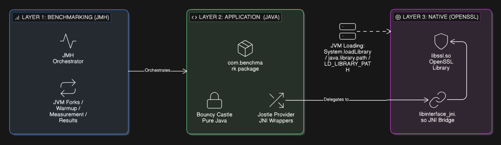

## JMH Benchmarking Framework

### Why using JMH?

Standard Java benchmarking using `System.nanoTime()` produces unreliable results for three reasons.

1. JIT compilation causes a performance profile that changes over time. The JVM interprets bytecode during early invocations and later compiles hot methods into optimized native code. Measurements taken during interpretation do not represent steady-state performance.

2. Garbage collection introduces non-deterministic pauses. A GC event during a measurement window can inflate the reported time by orders of magnitude.

3. Dead code elimination allows the JVM to optimize away computations whose results are unused. A naive benchmark that discards its output may measure nothing at all.

JMH addresses these problems through three mechanisms. It runs each benchmark in a separate JVM fork, isolating it from the parent process and prior benchmark state. It provides configurable warmup iterations that are executed but discarded, allowing the JIT compiler to reach steady state before measurement begins. It supplies `Blackhole` objects that consume computed results in a way the JVM cannot optimize away.

### Configuration Parameters

JMH exposes several parameters that control the statistical quality of results.

<br>

**Forks:** determine how many independent JVM processes execute the benchmark. Multiple forks reduce the impact of OS scheduling, ASLR, and other process-level variance.

**Warmup Iterations:** are benchmark cycles that execute before measurement begins. They exist solely to trigger JIT compilation and allow the JVM to reach thermal equilibrium.

**Measurement Iterations:** are the cycles where timing data is collected. More iterations reduce the standard error of the reported mean.

**Benchmark Modes:** control what metric is reported:

| Mode             | Flag     | Metric                             | Use Case                     |
| :--------------- | :------- | :--------------------------------- | :--------------------------- |
| Throughput       | `thrpt`  | Operations per second (ops/s)      | Overall capacity measurement |
| Average Time     | `avgt`   | Mean time per operation (ns/op)    | Latency measurement          |
| Sample Time      | `sample` | Percentile distribution (p50, p99) | Tail latency detection       |
| Single Shot Time | `ss`     | Time for one cold-start execution  | Startup cost measurement     |

### Benchmark Execution Script

The project provides a shell script that configures and launches the benchmarks. The relevant parameters are passed to Gradle as project properties.

<br>

Source: [`scripts/run_benchmarks.sh`](https://github.com/ngkore/jostle-bc-crypto-benchmarking/blob/main/scripts/run_benchmarks.sh)

```bash
WARMUP=1
ITERATIONS=3
TIME="1s"
FORK=1
MODE="all"

GRADLE_ARGS="-PjmhWarmup=$WARMUP -PjmhIterations=$ITERATIONS -PjmhTime=$TIME -PjmhForks=$FORK -PjmhMode=$MODE"
./gradlew jmh $GRADLE_ARGS --console=plain 2>&1 | tee "$LOG_FILE"
```

The script also configures the `NATIVE_LIB_PATH` environment variable, which the Gradle build passes to the JVM as `java.library.path`. This is required for the Jostle provider to locate and load `libinterface_jni.so` and `libssl.so` at runtime.

> **Note:** The above values were being used for generating the current benchmarking results (JSON).

## JCA Provider Model

The Java Cryptography Architecture (JCA) defines a provider-independent API for cryptographic operations. Applications call factory methods such as `Cipher.getInstance("AES")` or `Signature.getInstance("ML-DSA")`, and the JCA runtime resolves these to provider-specific implementations through the Service Provider Interface (SPI).

### SPI Contract

For each cryptographic service, the JCA defines two classes:

- An **application-facing class** (e.g., `javax.crypto.Cipher`) that provides the public API.
- An **SPI class** (e.g., `javax.crypto.CipherSpi`) that defines the methods a provider must implement.

When application code calls `Cipher.getInstance("AES", provider)`, the JCA:

1. Looks up the `provider` object's service registry.
2. Finds the implementation class mapped to `"Cipher.AES"`.
3. Instantiates that class (which must extend `CipherSpi`) via reflection.
4. Wraps it inside a `Cipher` object and returns it to the caller.

This indirection allows application code to remain provider-agnostic. The same `Cipher.doFinal()` call executes Bouncy Castle's pure-Java AES engine or Jostle's native OpenSSL AES implementation depending on which provider was specified.

### Provider Registration

Both providers in this project implement the registration step differently, reflecting their distinct architectural philosophies.

> **Note:** This is not a part of the project itself, this is something I get aware of during the project. Consider this a pre-requisite for beginners.

## Benchmark Class

The project might look big but the main source code lies around only 4 files which is organized as a class hierarchy rooted at `CryptoBenchmark`.

```
CryptoBenchmark (abstract)
  |-- SymmetricBenchmark (abstract)
  |     |-- aes
  |     |-- aria
  |     |-- camellia
  |     |-- sm4
  |
  |-- PqcBenchmark (abstract)
  |     |-- mldsa
  |     |-- slhdsa
  |     |-- mlkem
  |
  |-- KdfBenchmark (abstract)
        |-- pbkdf2
        |-- scrypt
```

### 1. CryptoBenchmark.java - Provider Initialization

The base class holds the provider instance and the parameterized provider name. JMH's `@Param` annotation causes the benchmark to be executed once per listed value, producing results for both providers from a single run.

<br>

Source: [`src/main/java/com/benchmark/CryptoBenchmark.java`](https://github.com/ngkore/jostle-bc-crypto-benchmarking/blob/main/src/main/java/com/benchmark/CryptoBenchmark.java)

```java
@State(Scope.Benchmark)
public abstract class CryptoBenchmark {

    @Param({"BC", "Jostle"})
    public String providerName;

    public Provider provider;

    public void initProvider() {
        if ("BC".equalsIgnoreCase(providerName)) {
            provider = new BouncyCastleProvider();
        } else if ("Jostle".equalsIgnoreCase(providerName)) {
            provider = new JostleProvider();
        } else {
            throw new IllegalArgumentException("Unknown provider: " + providerName);
        }
        Security.addProvider(provider);
    }
}
```

The `@State(Scope.Benchmark)` annotation tells JMH that a single instance of this class is shared across all threads executing a given benchmark method. The `initProvider()` method is called from each subclass's `@Setup` method before any benchmark iteration begins.

### 2. SymmetricBenchmark.java -- Cipher Operations

The symmetric benchmark subclass parameterizes over cipher transformations (algorithm/mode/padding) and key sizes. The `commonSetup` method constructs a key, generates test data, and pre-computes the ciphertext used by the decryption benchmark.

<br>

Source: [`src/main/java/com/benchmark/SymmetricBenchmark.java`](https://github.com/ngkore/jostle-bc-crypto-benchmarking/blob/main/src/main/java/com/benchmark/SymmetricBenchmark.java)

```java
public abstract class SymmetricBenchmark extends CryptoBenchmark {

    protected SecretKey key;
    protected byte[] data;
    protected byte[] encryptedData;
    protected AlgorithmParameterSpec params;
    protected String transform;

    protected void commonSetup(String transform, int keySize) throws Exception {
        this.transform = transform;
        initProvider();

        String[] parts = transform.split("/");
        String algorithm = parts[0];
        String mode = parts[1];

        // ... key generation and IV/nonce setup ...

        Cipher encryptCipher = Cipher.getInstance(transform, provider);
        // ... encrypt test data for decryption benchmark ...
    }

    @Benchmark
    public void encrypt(Blackhole bh) throws Exception {
        Cipher cipher = Cipher.getInstance(transform, provider);
        if (params != null) {
            cipher.init(Cipher.ENCRYPT_MODE, key, params);
        } else {
            cipher.init(Cipher.ENCRYPT_MODE, key);
        }
        bh.consume(cipher.doFinal(data));
    }

    @Benchmark
    public void decrypt(Blackhole bh) throws Exception {
        Cipher cipher = Cipher.getInstance(transform, provider);
        if (params != null) {
            cipher.init(Cipher.DECRYPT_MODE, key, params);
        } else {
            cipher.init(Cipher.DECRYPT_MODE, key);
        }
        bh.consume(cipher.doFinal(encryptedData));
    }
}
```

Each concrete subclass declares its own `@Param` sets. For example, the `Aes` subclass benchmarks AES across GCM, ECB, CBC, CTR, OFB, and CFB modes with 128, 192, and 256-bit keys. The `Sm4` subclass is restricted to 128-bit keys per the SM4 specification.

> **Note:** `Cipher.getInstance(transform, provider)` is called inside the `@Benchmark` method itself, not in `@Setup`. This is intentional: the benchmark measures the full cost of provider lookup, cipher instantiation, initialization, and execution.

### 3. KdfBenchmark.java - KDF Operations

The `KdfBenchmark` abstract class extends `CryptoBenchmark` and provides shared state for both PBKDF2 and Scrypt benchmarks: a password and a salt. The `commonSetup` method initializes the provider and sets fixed input values used across all KDF benchmark iterations.

<br>

Source: [`src/main/java/com/benchmark/KdfBenchmark.java`](https://github.com/ngkore/jostle-bc-crypto-benchmarking/blob/main/src/main/java/com/benchmark/KdfBenchmark.java)

```java
public abstract class KdfBenchmark extends CryptoBenchmark {

    protected char[] password;
    protected byte[] salt;

    protected void commonSetup() throws Exception {
        initProvider();
        password = "password".toCharArray();
        salt = new byte[16]; // 128-bit salt
    }
```

The password and salt are fixed across iterations. This is intentional: the benchmark measures the computational cost of the derivation function itself, not the variance introduced by different inputs. A 128-bit (16-byte) salt is standard for both PBKDF2 and Scrypt.

#### 3.1 PBKDF2 Benchmark

PBKDF2 derives a key by iteratively applying a pseudorandom function (PRF), typically HMAC with a chosen hash algorithm to the password and salt. The iteration count is the primary cost parameter: higher counts produce slower derivations.

<br>

Source: [`src/main/java/com/benchmark/KdfBenchmark.java`](https://github.com/ngkore/jostle-bc-crypto-benchmarking/blob/main/src/main/java/com/benchmark/KdfBenchmark.java)

```java
public static class Pbkdf2 extends KdfBenchmark {

    @Benchmark
    public void deriveKey(Blackhole bh) throws Exception {
        SecretKeyFactory skf = SecretKeyFactory.getInstance(algorithm, provider);
        PBEKeySpec spec = new PBEKeySpec(password, salt, iterations, 256);
        bh.consume(skf.generateSecret(spec));
    }
}
```

The benchmark parameterizes over 11 HMAC-based PRF variants spanning three hash families: SHA-2 , SHA-3, and SM3. Each variant is benchmarked at two iteration counts - 1,000 and 10,000, producing 22 benchmark configurations per provider.

The PBKDF2 benchmark code is entirely provider-agnostic. Both `SecretKeyFactory` and `PBEKeySpec` are standard JCA classes (`javax.crypto.SecretKeyFactory` and `javax.crypto.spec.PBEKeySpec`). No provider-specific imports or conditional branches are needed. This is possible because the `SecretKeyFactory.generateSecret(KeySpec)` method accepts a standard `PBEKeySpec` and returns a standard `SecretKey` - a single input, single output contract that maps cleanly onto the SPI model.

#### 3.2 Scrypt Benchmark

Scrypt (RFC 7914) is a memory-hard KDF designed to be expensive to parallelize on custom hardware (ASICs/FPGAs). It achieves this by requiring a large amount of memory proportional to the cost parameter `N`. The algorithm also takes a block size parameter `r` (which determines the size of the internal mixing function) and a parallelization parameter `p` (which controls independent mixing lanes).

<br>

Source: [`src/main/java/com/benchmark/KdfBenchmark.java`](https://github.com/ngkore/jostle-bc-crypto-benchmarking/blob/main/src/main/java/com/benchmark/KdfBenchmark.java)

```java
public static class Scrypt extends KdfBenchmark {

 // ... parameters ...
    @Benchmark
    public void deriveKey(Blackhole bh) throws Exception {
        SecretKeyFactory skf = SecretKeyFactory.getInstance("SCRYPT", provider);

        KeySpec spec;
        // Fixed parameters: r=8, p=1, keyLen=256
        int r = 8;
        int p = 1;
        int keyLen = 256;

        if ("BC".equalsIgnoreCase(providerName)) {
            spec = new org.bouncycastle.jcajce.spec.ScryptKeySpec(password, salt, N, r, p, keyLen);
        } else {
             // OpenSSL Jostle provider
            spec = new org.openssl.jostle.jcajce.spec.ScryptKeySpec(password, salt, N, r, p, keyLen);
        }
        bh.consume(skf.generateSecret(spec));
    }
}
```

The benchmark parameterizes the cost parameter `N` at two values: 16,384 (2^14) and 32,768 (2^15). The block size `r = 8` and parallelization `p = 1` are fixed at standard values. The derived key length is 256 bits.

Unlike PBKDF2, the Scrypt benchmark requires provider-specific conditional branching. Both providers require a custom `ScryptKeySpec` class to carry the Scrypt-specific parameters (`N`, `r`, `p`), and the standard JCA `KeySpec` hierarchy does not include a Scrypt-aware specification or atleast I am not aware of.

The two `ScryptKeySpec` classes reside in different packages (`org.bouncycastle.jcajce.spec` vs `org.openssl.jostle.jcajce.spec`) and cannot be used interchangeably, even though they are structurally identical.

**Bouncy Castle:**

Source: [`org/bouncycastle/jcajce/spec/ScryptKeySpec.java`](https://github.com/bcgit/bc-java/blob/main/prov/src/main/java/org/bouncycastle/jcajce/spec/ScryptKeySpec.java#L10)

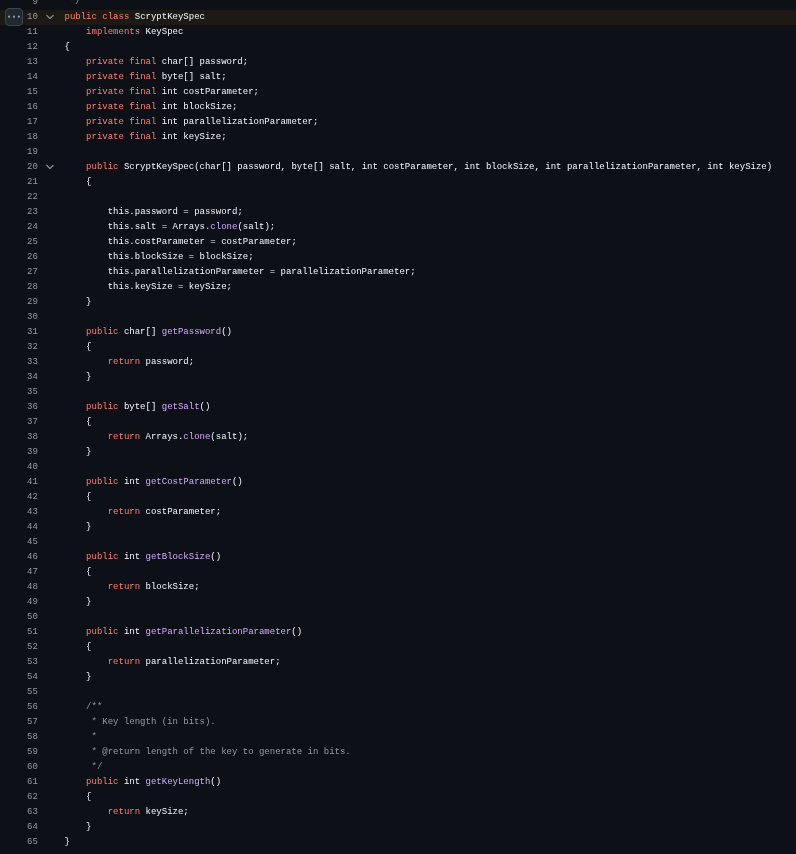

**Jostle:**

Source: [`org/openssl/jostle/jcajce/spec/ScryptKeySpec.java`](https://github.com/openssl-projects/openssl-jostle/blob/main/jostle/src/main/java/org/openssl/jostle/jcajce/spec/ScryptKeySpec.java#L12)

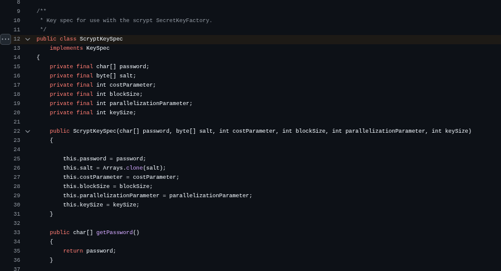

### 4. PqcBenchmark.java - PQ Operations

The PQC benchmark subclass introduces `KeyPair` and raw `byte[]` data as shared state. Each PQC inner class benchmarks three operations: key generation, signing/encapsulation, and verification/decapsulation. The ML-DSA and SLH-DSA classes use the standard `Signature` API. The ML-KEM class requires provider-specific code.

#### 4.1. ML-DSA Benchmark

ML-DSA (Module-Lattice-Based Digital Signature Algorithm, FIPS 204) is one of the three NIST-standardized post-quantum algorithms. Both providers implement it using the standard `java.security.Signature` API, which makes the benchmark code entirely provider-agnostic. The `Signature` API defines a contract where `sign()` returns a `byte[]` and `verify()` accepts a `byte[]`. These return types are part of the standard `java.security.SignatureSpi` interface. Since ML-DSA is a pure signature scheme that produces and verifies byte arrays, it maps perfectly onto this existing contract. No provider-specific types are needed.

<br>

Source: [`src/main/java/com/benchmark/PqcBenchmark.java`](https://github.com/ngkore/jostle-bc-crypto-benchmarking/blob/main/src/main/java/com/benchmark/PqcBenchmark.java)

```java
public static class MlDsa extends PqcBenchmark {
    @Param({
        "ML-DSA-44",
        "ML-DSA-65",
        "ML-DSA-87"
    })
    public String algorithm;

    private byte[] signature;

    @Setup(Level.Trial)
    public void setup() throws Exception {
        initProvider();
        KeyPairGenerator kpg = KeyPairGenerator.getInstance(algorithm, provider);
        keyPair = kpg.generateKeyPair();

        data = new byte[1024];
        new SecureRandom().nextBytes(data);

        Signature sig = Signature.getInstance(algorithm, provider);
        sig.initSign(keyPair.getPrivate());
        sig.update(data);
        signature = sig.sign();
    }

    @Benchmark
    public void sign(Blackhole bh) throws Exception {
        Signature sig = Signature.getInstance(algorithm, provider);
        sig.initSign(keyPair.getPrivate());
        sig.update(data);
        bh.consume(sig.sign());
    }

    @Benchmark
    public void verify(Blackhole bh) throws Exception {
        Signature sig = Signature.getInstance(algorithm, provider);
        sig.initVerify(keyPair.getPublic());
        sig.update(data);
        bh.consume(sig.verify(signature));
    }
}
```

This code works identically for both providers. The only difference is the internal execution path: Jostle's `MLDSASignatureSpi` calls through JNI to OpenSSL's ML-DSA implementation, while Bouncy Castle's `SignatureSpi$MLDSA` executes a pure-Java implementation.

**Jostle** registers ML-DSA signatures by directly mapping algorithm names to an SPI class backed by native OpenSSL.

Source: [`org/openssl/jostle/jcajce/provider/ProvMLDSA.java`](https://github.com/openssl-projects/openssl-jostle/blob/main/jostle/src/main/java/org/openssl/jostle/jcajce/provider/ProvMLDSA.java#L48)

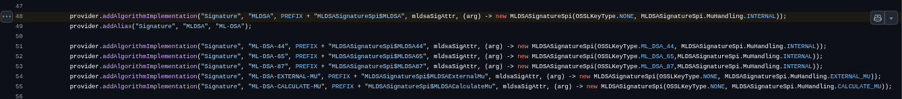

The `MLDSASignatureSpi` class extends `java.security.SignatureSpi` and implements `engineSign()` and `engineVerify()` by calling native methods through the `NISelector.MLDSAServiceNI` interface.

**Bouncy Castle** uses its `$Mappings` pattern to register variant-specific signature classes.

Source: [`org/bouncycastle/jcajce/provider/asymmetric/MLDSA.java`](https://github.com/bcgit/bc-java/blob/main/prov/src/main/java/org/bouncycastle/jcajce/provider/asymmetric/MLDSA.java#L46)

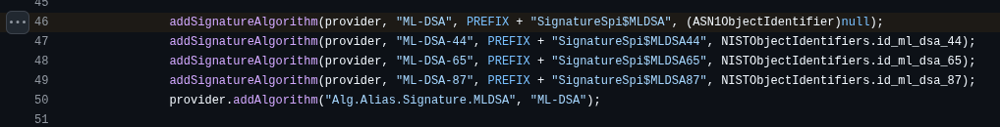

Because both providers produce and consume standard `byte[]` signatures through the standard `SignatureSpi` contract, the benchmark code requires no conditional branching or provider-specific imports for ML-DSA.

#### 4.2 ML-KEM Benchmark

ML-KEM (Module-Lattice-Based Key-Encapsulation Mechanism, FIPS 203) presents a fundamentally different challenge from ML-DSA. Unlike signature schemes, a KEM produces two outputs: a shared secret and an encapsulation (ciphertext). The standard JCA `KeyGenerator.generateKey()` method returns a single `SecretKey` object and has no mechanism to return the second output (the encapsulation byte array alongside the key). This section explains how each provider works around this limitation and why the benchmark code requires provider-specific branches.

<br>

Source: [`src/main/java/com/benchmark/PqcBenchmark.java`](https://github.com/ngkore/jostle-bc-crypto-benchmarking/blob/main/src/main/java/com/benchmark/PqcBenchmark.java)

```java
// encapsulation benchmark
@Benchmark
public void encaps(Blackhole bh) throws Exception {
    if ("Jostle".equalsIgnoreCase(providerName)) {
        KeyGenerator kg = KeyGenerator.getInstance("ML-KEM", provider);
        kg.init(KEMGenerateSpec.builder()
                .withPublicKey(keyPair.getPublic())
                .withKeySizeInBits(256)
                .withAlgorithmName("AES")
                .build());
        bh.consume(kg.generateKey());
    } else {
        // Bouncy Castle provider
        KeyGenerator kg = KeyGenerator.getInstance("ML-KEM", provider);
        kg.init(new org.bouncycastle.jcajce.spec.KEMGenerateSpec(keyPair.getPublic(), "AES"),
                new SecureRandom());
        bh.consume(kg.generateKey());
    }
}
```

Both providers work around this by returning a composite object: a custom subclass of `SecretKey` that bundles the shared secret and the encapsulation together. The caller must cast the returned `SecretKey` to the provider-specific subclass to access the encapsulation.

Both providers define nearly identical classes for this purpose:

**Bouncy Castle:**

Source: [`org/bouncycastle/jcajce/SecretKeyWithEncapsulation.java`](https://github.com/bcgit/bc-java/blob/main/prov/src/main/java/org/bouncycastle/jcajce/SecretKeyWithEncapsulation.java#L10)

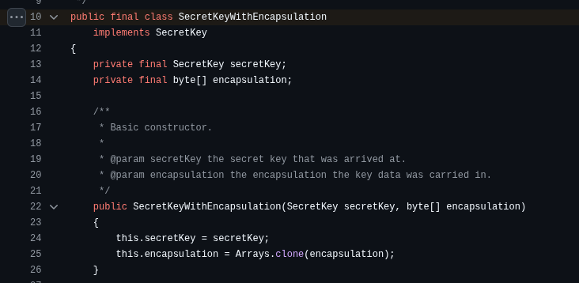
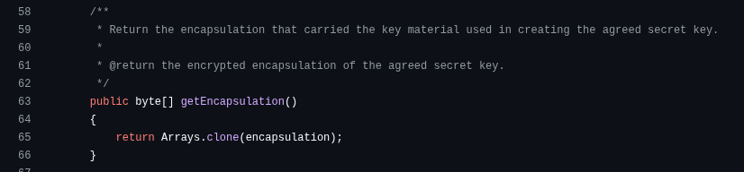

**Jostle:**

Source: [`org/openssl/jostle/jcajce/SecretKeyWithEncapsulation.java`](https://github.com/openssl-projects/openssl-jostle/blob/main/jostle/src/main/java/org/openssl/jostle/jcajce/SecretKeyWithEncapsulation.java#L17)

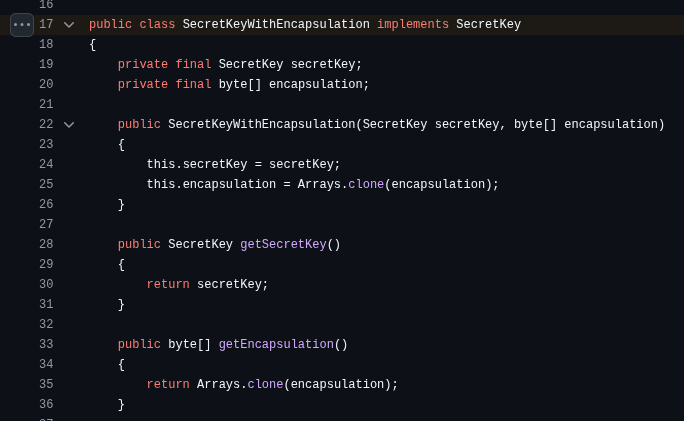

#### 4.3 Provider-Specific Encaps/Decaps

Beyond the return type issue, each provider also requires its own `AlgorithmParameterSpec` to initialize the `KeyGenerator`. Jostle defines `KEMGenerateSpec` and `KEMExtractSpec` with a builder pattern. Bouncy Castle defines its own `KEMGenerateSpec` and `KEMExtractSpec` classes in its `jcajce.spec` package.

<br>

**Bouncy Castle's encapsulation:** [`org/bouncycastle/jcajce/spec/KEMGenerateSpec.java`](https://github.com/bcgit/bc-java/blob/main/prov/src/main/java/org/bouncycastle/jcajce/spec/KEMGenerateSpec.java#L11)

**Jostle's encapsulation:** [`org/openssl/jostle/jcajce/spec/KEMGenerateSpec.java`](https://github.com/openssl-projects/openssl-jostle/blob/main/jostle/src/main/java/org/openssl/jostle/jcajce/spec/KEMGenerateSpec.java#L16)

**Bouncy Castle's decapsulation:** [`org/bouncycastle/jcajce/spec/KEMExtractSpec.java`](https://github.com/bcgit/bc-java/blob/main/prov/src/main/java/org/bouncycastle/jcajce/spec/KEMExtractSpec.java#L11)

**Jostle's decapsulation:** [`org/openssl/jostle/jcajce/spec/KEMExtractSpec.java`](https://github.com/openssl-projects/openssl-jostle/blob/main/jostle/src/main/java/org/openssl/jostle/jcajce/spec/KEMExtractSpec.java#L18)

Under the hood, Jostle's `MLKEMKeyGenerator.engineGenerateKey()` calls native OpenSSL functions for the actual KEM operation.

#### 4.4 Bouncy Castle's Alternative Approaches to ML-KEM

##### 4.4.1 Cipher-Based Key Wrapping

In addition to the `KeyGenerator` workaround, Bouncy Castle also registers ML-KEM as a `Cipher` implementation that supports key wrapping. This allows provider-agnostic code to use the standard `Cipher.wrap()`/`Cipher.unwrap()` API.

Source: [`org/bouncycastle/jcajce/provider/asymmetric/MLKEM.java`](https://github.com/bcgit/bc-java/blob/main/prov/src/main/java/org/bouncycastle/jcajce/provider/asymmetric/MLKEM.java#L44)

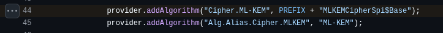

The `MLKEMCipherSpi.engineWrap()` method performs KEM encapsulation internally and concatenates the encapsulation with the wrapped key into a single `byte[]`.

Source: [`org/bouncycastle/jcajce/provider/asymmetric/mlkem/MLKEMCipherSpi.java`](https://github.com/bcgit/bc-java/blob/main/prov/src/main/java/org/bouncycastle/jcajce/provider/asymmetric/mlkem/MLKEMCipherSpi.java#L238)

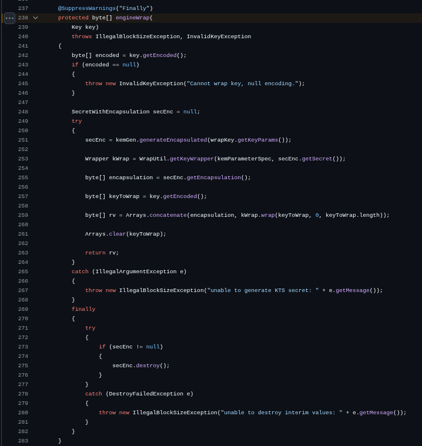

This approach hides the two-output problem inside the `Cipher` byte array protocol. However, Jostle does not provide a `Cipher`-based ML-KEM implementation, so this approach cannot be used for cross-provider benchmarking. Besides, the `Cipher` path introduces additional key wrapping overhead that would conflate the KEM measurement with symmetric encryption cost.

##### 4.4.2 Standard KEM API (JEP 452)

Java 21 introduced `javax.crypto.KEM` (JEP 452), a standard API designed specifically for key encapsulation mechanisms. This API resolves the two-output problem cleanly:

```java
KEM kem = KEM.getInstance("ML-KEM", provider);
KEM.Encapsulator encapsulator = kem.newEncapsulator(publicKey);
KEM.Encapsulated encapsulated = encapsulator.encapsulate();

SecretKey sharedSecret = encapsulated.key();
byte[] encapsulation = encapsulated.encapsulation();
```

The `KEM.Encapsulated` return type carries both the shared secret and the encapsulation. The `KEM.Decapsulator` provides a symmetric `decapsulate(byte[])` method that recovers the shared secret from an encapsulation.

Bouncy Castle implements this standard API through `MLKEMSpi`, a class that implements `javax.crypto.KEMSpi`. It is registered in the JDK17+ multi-release overlay of the Bouncy Castle JAR.

Source: [`prov/src/main/jdk17/org/bouncycastle/jcajce/provider/asymmetric/mlkem/MLKEMSpi.java`](https://github.com/bcgit/bc-java/blob/main/prov/src/main/jdk17/org/bouncycastle/jcajce/provider/asymmetric/mlkem/MLKEMSpi.java#L15)

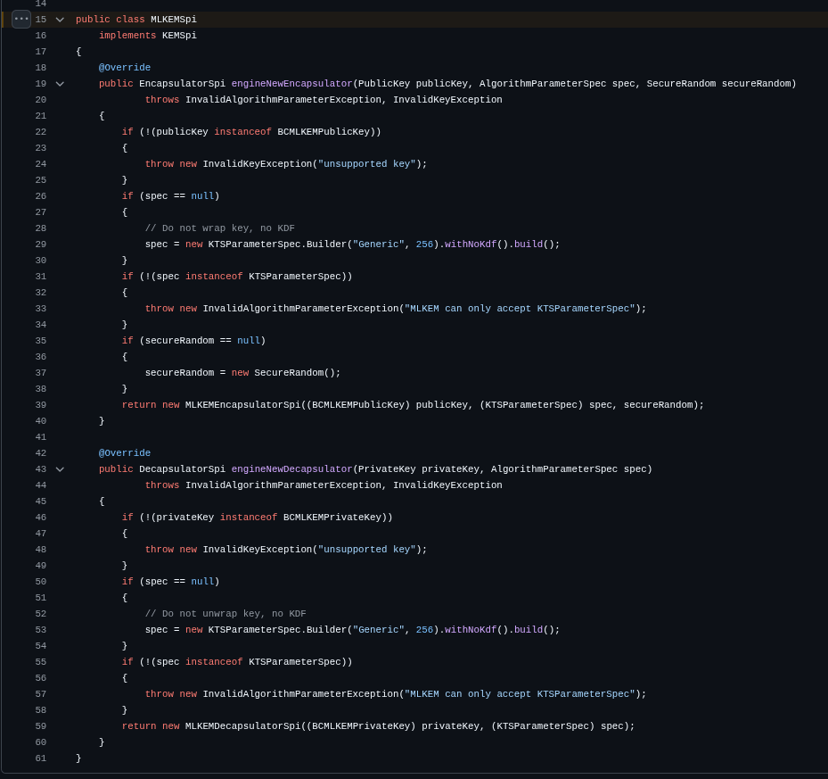

The KEM service registration appears only in the JDK17+ overlay of `MLKEM.java`:

Source: [`prov/src/main/jdk17/org/bouncycastle/jcajce/provider/asymmetric/MLKEM.java`](https://github.com/bcgit/bc-java/blob/main/prov/src/main/jdk17/org/bouncycastle/jcajce/provider/asymmetric/MLKEM.java#L56)

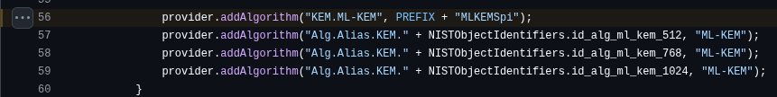

This registration is absent from the base version of `MLKEM.java` (in `prov/src/main/java/`), which only registers `KeyFactory`, `KeyPairGenerator`, `KeyGenerator`, and `Cipher` services.

**Jostle** does not implement `javax.crypto.KEMSpi` at all. The `src/main/java21/` source directory in the Jostle project is empty. ML-KEM is only accessible through the `KeyGenerator` + `KEMGenerateSpec`/`KEMExtractSpec` pattern.

The benchmark uses the `KeyGenerator` path because it is the only API supported by both providers, enabling a direct side-by-side comparison of the raw KEM primitive.

## Build Configuration

### Gradle Setup

The project uses the `me.champeau.jmh` Gradle plugin (version 0.7.3) to integrate JMH into the build lifecycle.

<br>

Source: [`build.gradle`](https://github.com/ngkore/jostle-bc-crypto-benchmarking/blob/main/build.gradle)

```groovy
plugins {
    id 'java'
    id 'me.champeau.jmh' version '0.7.3'
}

java {
    toolchain {
        languageVersion = JavaLanguageVersion.of(25)
    }
}

dependencies {
    implementation fileTree(dir: 'libs', include: ['*.jar'])
    implementation 'org.openjdk.jmh:jmh-core:1.37'
    annotationProcessor 'org.openjdk.jmh:jmh-generator-annprocess:1.37'
}
```

The provider JARs (`bcprov-jdk18on-1.84-SNAPSHOT.jar` and `openssl-jostle-1.0-SNAPSHOT.jar`) are loaded from the `libs/` directory. JMH 1.37 is used for benchmark annotation processing and runtime.

### JVM Arguments

The JMH block configures JVM arguments that are passed to the forked benchmark process.

```groovy
jvmArgs = [
    '--enable-native-access=ALL-UNNAMED',
    '-Dorg.openssl.jostle.loader.load_name_0=interface_jni',
    '-XX:+UseG1GC',
    '-XX:MaxGCPauseMillis=200',
    '-XX:+IgnoreUnrecognizedVMOptions',
    '--add-opens=java.base/java.lang=ALL-UNNAMED',
    '--add-opens=java.base/sun.misc=ALL-UNNAMED',
    '-Djmh.separateClasspathJAR=true',
    '-Djava.io.tmpdir=/tmp'
]
```

`--enable-native-access=ALL-UNNAMED` permits the Jostle provider to call native methods without module access warnings. The `loader.load_name_0` property tells the Jostle native loader which shared library to load. `--add-opens` flags are required because JMH internally accesses non-exported JDK internals for its benchmarking infrastructure. The G1 garbage collector with a 200ms pause target provides consistent GC behavior across benchmark runs.

### Result Output

Benchmark results are written in JSON format to `results/results.json`. This file is consumed by the project's web-based visualizer: [https://ngkore.github.io/jostle-bc-crypto-benchmarking/](https://ngkore.github.io/jostle-bc-crypto-benchmarking/).

```groovy
resultFormat = 'JSON'
resultsFile = project.file("${project.projectDir}/results/results.json")
```
