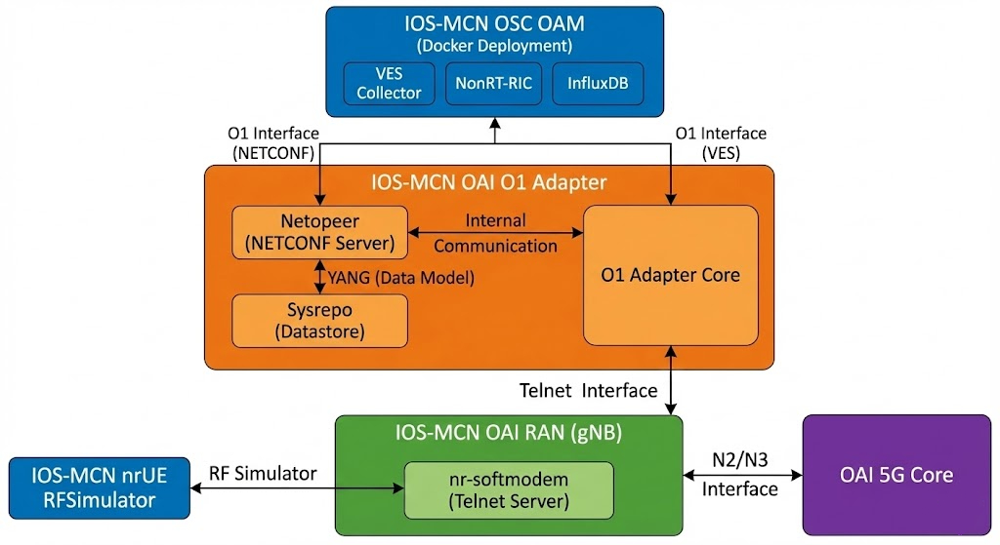

# IOSMCN RAN

**Author:** [Shubham Kumar](https://www.linkedin.com/in/chmodshubham/) & [Ronak Kanthaliya](https://www.linkedin.com/in/ronak-kanthaliya-127003194/)

**Published:** November 19, 2025

Please refer to [OAI](https://gitlab.eurecom.fr/oai/openairinterface5g/-/blob/develop/doc/NR_SA_Tutorial_OAI_nrUE.md?ref_type=heads) for the official documentation.



> **Note:** This documentation is a replica of the README available at the [github/ngkore/IOSMCN-OAI](https://github.com/ngkore/IOSMCN-OAI). Please refer to the original repository for the most up-to-date information.

## System Preparation

### Install General Dependencies

Install the necessary build tools and libraries for OAI.

```bash
sudo apt update
sudo apt install -y autoconf automake build-essential ccache cmake cpufrequtils \
  doxygen ethtool g++ git inetutils-tools libboost-all-dev libncurses-dev \
  libusb-1.0-0 libusb-1.0-0-dev libusb-dev python3-dev python3-mako \
  python3-numpy python3-requests python3-scipy python3-setuptools python3-ruamel.yaml \
  libcap-dev libblas-dev liblapacke-dev libatlas-base-dev
```

### Install Scope Dependencies

Required for the `nrscope` visualization tool.

```bash
sudo apt install -y libforms-dev libforms-bin
```

### Install `yaml-cpp` from source

> **Important:** Do **not** install `yaml-cpp` using `sudo apt install libyaml-cpp-dev` as it is known to cause build failures (see below). Build it from source instead.


```bash
cd
git clone https://github.com/jbeder/yaml-cpp.git
cd yaml-cpp
mkdir build && cd build
cmake .. -DYAML_BUILD_SHARED_LIBS=ON
make -j$(nproc)
sudo make install
sudo ldconfig
cd
rm -r yaml-cpp/
```

### Install UHD (Only for USRP Hardware)

If you are planning to test it in **RF Simulator mode only**, then you can skip this. For **USRP Hardware**, this is mandatory. Either follow the [UHD Build Guide](https://files.ettus.com/manual/page_build_guide.html) or use the commands below:

```bash
git clone https://github.com/EttusResearch/uhd.git ~/uhd
cd ~/uhd
git checkout v4.7.0.0
cd host
mkdir build
cd build
cmake ../
make -j $(nproc)
# make test # Optional
sudo make install
sudo ldconfig
sudo uhd_images_downloader
```

## Build IOSMCN OAI RAN

### Clone Repository

```bash
git clone https://github.com/ios-mcn/ios-mcn-releases.git
cd ios-mcn-releases/Agartala/v0.4.0/RAN/source-code/
tar -xzf ios-mcn-ran-0.4.0.iosmcn.ran.tar.gz
mv ios-mcn-ran-0.4.0.iosmcn.ran ~/ran
cd ~/ran/openairinterface5g/
```

### Set Execute Permissions

Set execute permissions for all scripts and executables.

```bash
chmod -R +x .
```

### Install dependencies

```bash
cd cmake_targets/
./build_oai -I
```

### Build gNB and nrUE

This command builds both the gNB and UE with support for the OAI Scope and Ninja build system.

```bash
# replace SIMU with USRP if you want to build it for USRP hardware
./build_oai -w SIMU --ninja --nrUE --gNB --build-lib "nrscope" -C

# to build telnet management server - needed to communicate with O1 adapter
./build_oai --build-lib telnetsrv
```

## Configuration Changes

Edit the gNB configuration file located at `openairinterface5g/targets/PROJECTS/GENERIC-NR-5GC/CONF/gnb.sa.band78.fr1.106PRB.usrpb210.conf` and make the following changes:

- Change the `gNB_ID` to `0xe00`.
- Remove th `sd` value from the `plmn_list` section. (remove `sd = 0x000000;`).
- Change `amf_ip_address` to `192.168.70.132`.
- Change the `GNB_IPV4_ADDRESS_FOR_NG_AMF` and `GNB_IPV4_ADDRESS_FOR_NGU` to `192.168.70.129/24`.

## Run gNB (RFsim Mode)

```bash
cd ~/ran/openairinterface5g/cmake_targets/ran_build/build

sudo ./nr-softmodem \
  -O ../../../targets/PROJECTS/GENERIC-NR-5GC/CONF/gnb.sa.band78.fr1.106PRB.usrpb210.conf \
  --rfsim \
  --gNBs.[0].min_rxtxtime 6
```

Append the following flags to add telnet server support:

```bash
--telnetsrv \
--telnetsrv.listenport 9090 \
--telnetsrv.shrmod o1
```

> **Note:** For USRP models, please refer [ngkore/OAI-RAN](https://github.com/ngkore/OAI-RAN) repository.

## Run nrUE (RFsim Mode)

Run this command on the same host as the OAI gNB.

```bash
cd ~/ran/openairinterface5g/cmake_targets/ran_build/build

sudo ./nr-uesoftmodem \
  -r 106 \
  --numerology 1 \
  --band 78 \
  -C 3619200000 \
  --rfsim \
  --uicc0.imsi 001010000000001
```

### End-to-End Connectivity Test

Ping test from the UE host to the CN5G

```bash
ping 192.168.70.135 -I oaitun_ue1
```
