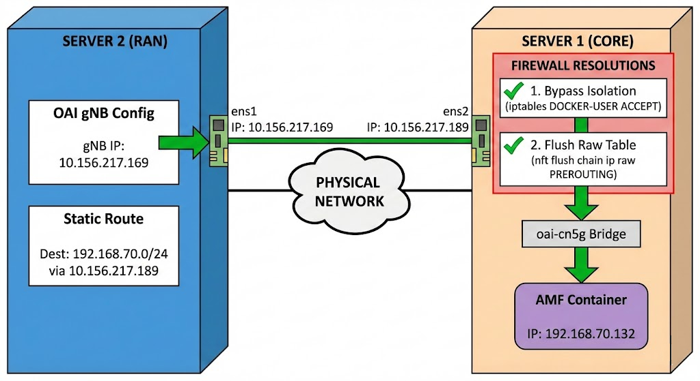

# OAI NGAP Split

**Author:** [Shubham Kumar](https://www.linkedin.com/in/chmodshubham/) & [Shankar Malik](https://www.linkedin.com/in/evershalik/)

**Published:** January 01, 2026

This document outlines the procedures for deploying the OpenAirInterface (OAI) 5G Core Network and gNodeB (gNB) on separate servers (disaggregated mode).



> **Note:** This documentation is a replica of the README available at the [github/ngkore/OAI_NGAP_Split](https://github.com/ngkore/OAI_NGAP_Split). Please refer to the original repository for the most up-to-date information.

## 1. Prerequisites

Before proceeding, ensure the following independent setups are complete:

- **Server 1 (Core):** Deploy the OAI 5G Core by following the instructions at [ngkore/OAI-CN5G](https://github.com/ngkore/OAI-CN5G).
- **Server 2 (RAN):** Deploy the OAI gNB by following the instructions at [ngkore/OAI-RAN](https://github.com/ngkore/OAI-RAN).

> **Note:** Ensure that the configurations are synchronized between the Core and gNB configuration files as per their respective repository instructions.

## 2. Network Configuration

To enable communication between the physically separated gNB and 5G Core, you must update the gNB configuration and establishing a route to the Core's internal Docker network.

### Step 2.1: Update gNB Configuration

Locate and edit the gNB configuration file on the RAN server.
**File Path:** `/openairinterface5g/targets/PROJECTS/GENERIC-NR-5GC/CONF/gnb.sa.band78.fr1.106PRB.usrpb210.conf` (or your specific configuration file).

<br>

Update the **Network Interfaces** section to bind to the RAN Server's physical IP address:

```diff
diff --git a/targets/PROJECTS/GENERIC-NR-5GC/CONF/gnb.sa.band78.fr1.106PRB.usrpb210.conf b/targets/PROJECTS/GENERIC-NR-5GC/CONF/gnb.sa.band78.fr1.106PRB.usrpb210.conf
index 7f750d7259..d6479024f3 100644
--- a/targets/PROJECTS/GENERIC-NR-5GC/CONF/gnb.sa.band78.fr1.106PRB.usrpb210.conf
+++ b/targets/PROJECTS/GENERIC-NR-5GC/CONF/gnb.sa.band78.fr1.106PRB.usrpb210.conf
@@ -160,8 +160,8 @@ gNBs =

     NETWORK_INTERFACES :
     {
-        GNB_IPV4_ADDRESS_FOR_NG_AMF              = "192.168.70.129/24";
-        GNB_IPV4_ADDRESS_FOR_NGU                 = "192.168.70.129/24";
+        GNB_IPV4_ADDRESS_FOR_NG_AMF              = "10.156.217.169/24";
+        GNB_IPV4_ADDRESS_FOR_NGU                 = "10.156.217.169/24";
         GNB_PORT_FOR_S1U                         = 2152; # Spec 2152
     };
```

### Step 2.2: Configure Static Routing (RAN Server)

The gNB needs to know how to reach the AMF container (subnet `192.168.70.0/24`) which resides inside the Core server.

<br>

Run the following command on the **RAN VM**:

```bash
# Syntax: sudo ip route add <container-subnet> via <core-vm-ip> dev <local-interface>
sudo ip route add 192.168.70.0/24 via 10.156.217.189 dev ens1
```

**Verification:**

Attempt to ping the AMF container from the RAN VM:

```bash
ping 192.168.70.132
```

- **If the ping succeeds:** Proceed to **Section 4**.
- **If the ping fails:** Proceed to **Section 3** to troubleshoot firewall issues.

## 3. Firewall Troubleshooting and Resolution

If network connectivity fails between the gNB and the Core, the issue is typically caused by strict firewall rules on the **Core Server** that block external traffic from reaching the internal Docker network.

### Step 3.1: Diagnosis

To identify if packets are being blocked, inspect the active firewall rules on the **Core VM** by running:

```bash
sudo nft list ruleset
```

Review the output for `drop` rules in the `filter` and `raw` tables. A typical blocking configuration will look like this:

```bash
ubuntu@ubuntu-01:~/oai-cn5g$ sudo nft list ruleset
...
table ip filter {
    chain DOCKER {
        # The Isolation Rule
        iifname != "docker0" oifname "docker0" counter packets 0 bytes 0 drop
        iifname != "oai-cn5g" oifname "oai-cn5g" counter packets 0 bytes 0 drop
    }
...
table ip raw {
    chain PREROUTING {
        type filter hook prerouting priority raw; policy accept;
        # The Explicit IP Drop Rules
        iifname != "oai-cn5g" ip daddr 192.168.70.131 counter packets 0 bytes 0 drop
        iifname != "oai-cn5g" ip daddr 192.168.70.132 counter packets 3 bytes 252 drop
        iifname != "oai-cn5g" ip daddr 192.168.70.133 counter packets 0 bytes 0 drop
        ...
    }
}
```

### Understanding the Blocking Rules:

1. **Network Isolation Rule (`table ip filter`)**

   > `iifname != "oai-cn5g" oifname "oai-cn5g" counter packets 0 bytes 0 drop`

- If a packet attempts to exit to the OAI network (`oifname "oai-cn5g"`) but did **not** originate from inside that same network (`iifname != "oai-cn5g"`), drop it.
- This rule prevents external traffic (coming from your physical interface, e.g., `ens2`) from talking to the containers.

2. **Explicit IP Drop Rules (`table ip raw`)**

   > `iifname != "oai-cn5g" ip daddr 192.168.70.x counter packets 0 bytes 0 drop`

- If the ingress interface is not `oai-cn5g` and the destination IP matches a specific container (e.g., `192.168.70.132`), drop the packet immediately.
- You can confirm this is the cause by looking at the counter: `counter packets 3 bytes 252 drop`. The non-zero packet count confirms that your ICMP/Ping requests were actively rejected by this rule.

### Step 3.2: Resolution

We cannot simply delete the Docker isolation rule as it may be recreated. Instead, we can bypass it and flush the specific blocking rules in the raw table.

<br>

**1. Bypass Docker Isolation**

Add a rule to the `DOCKER-USER` chain to explicitly accept traffic from your physical interface (`ens2`) destined for the OAI network.

```bash
# Syntax: sudo iptables -I DOCKER-USER -i <local-interface> -o oai-cn5g -j ACCEPT
sudo iptables -I DOCKER-USER -i ens2 -o oai-cn5g -j ACCEPT
```

**2. Flush Blocking Rules in the Raw Table**

The `PREROUTING` chain in the `raw` table contains explicit drop rules for the container IPs.

_Option A: Delete All (Recommended)_

This command will delete every rule inside the `PREROUTING` chain of the `raw` table.

```bash
sudo nft flush chain ip raw PREROUTING
```

_Option B: Delete One by One (Granular)_

If you prefer to delete only specific rules (e.g. only for the AMF and UPF IPs):

1. List rules with their handle IDs:

```bash
sudo nft -a list table ip raw
```

2. Delete the specific rule using its handle (e.g., handle 8):

```bash
# syntax: sudo nft delete rule ip raw PREROUTING handle <number>
sudo nft delete rule ip raw PREROUTING handle 8
```

> **Important:** These rules are managed by the OAI-CN5G wrapper scripts or Docker. If you restart the OAI core containers, these rules may reappear, and you will need to re-apply these fixes.

## 4. Execution and Testing

Try to ping the AMF container from the RAN VM again. Once network connectivity is verified, proceed to run the OAI components.

### Step 4.1: Run the gNB (RFsimulator Mode)

Use the RFsimulator for initial validation before deploying with real radio hardware.

<br>

On the **RAN Server**:

```bash
cd ~/openairinterface5g/cmake_targets/ran_build/build
sudo ./nr-softmodem -O ../../../targets/PROJECTS/GENERIC-NR-5GC/CONF/gnb.sa.band78.fr1.106PRB.usrpb210.conf --gNBs.[0].min_rxtxtime 6 --rfsim
```

### Step 4.2: Run the OAI nrUE

To test traffic flow, run the OAI-nrUE on the same host as the gNB.

<br>

On the **RAN Server** (new terminal window):

```bash
cd ~/openairinterface5g/cmake_targets/ran_build/build
sudo ./nr-uesoftmodem -r 106 --numerology 1 --band 78 -C 3619200000 --uicc0.imsi 001010000000001 --rfsim
```

If successful, the UE should attach to the network, and you will see signaling logs on both the AMF (Core Server) and gNB (RAN Server). Now, you can test with real radios and UE as per [ngkore/OAI-RAN](https://github.com/ngkore/OAI-RAN).

## Tutorial Video

[OpenAirInterface 5G Core and gNB Disaggregated Deployment (NGAP Split)](https://youtu.be/W1YAWWhsOco?si=nfC_VbSzK1pSnTIa)
