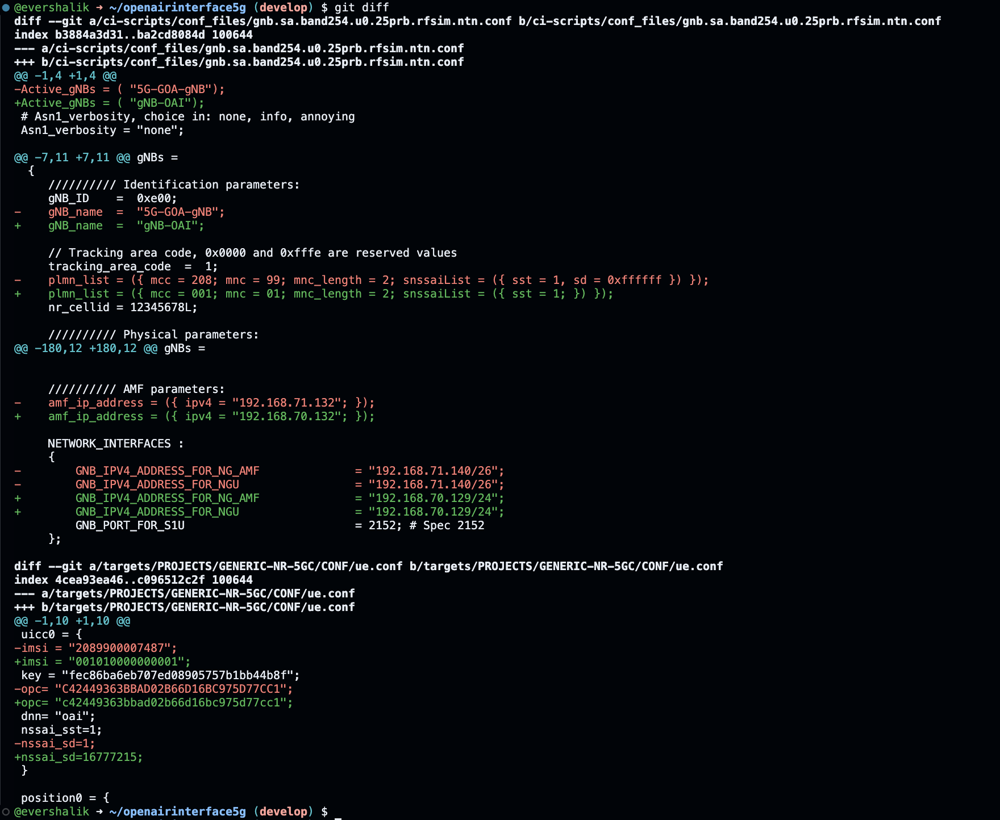

# OAI NR-5G NTN

**Author:** [Shankar Malik](https://www.linkedin.com/in/evershalik/)

**Published:** December 07, 2025

This repository provides a simple, repeatable guide for deploying and testing **Non-Terrestrial Network (NTN)** support in OpenAirInterface (OAI) using RFsimulated GEO and LEO satellite scenarios.


Official reference documentation: [https://gitlab.eurecom.fr/oai/openairinterface5g/-/blob/develop/doc/RUNMODEM.md#how-to-run-a-ntn-configuration](https://gitlab.eurecom.fr/oai/openairinterface5g/-/blob/develop/doc/RUNMODEM.md#how-to-run-a-ntn-configuration)

> **Note:** This documentation is a replica of the README available at the [github/ngkore/OAI-5G-NR-NTN](https://github.com/ngkore/OAI-5G-NR-NTN). Please refer to the original repository for the most up-to-date information.

## Overview

This setup runs in **simulated NTN mode** using RFsimulator.
For a complete NTN End-to-End (E2E) test, you will need:

- OAI nrUE
- RFsimulator (NTN channel simulation)
- OAI gNB
- OAI 5G Core (CN5G)

Two satellite orbit modes are supported:

1. **GEO (Geostationary Orbit)**
2. **LEO (Low Earth Orbit)** - coming soon

## Prerequisites

Before proceeding, ensure the **OAI 5G Core (CN5G)** is installed and running.

Setup guide:
[https://gitlab.eurecom.fr/oai/openairinterface5g/-/blob/develop/doc/NR_SA_Tutorial_OAI_CN5G.md](https://gitlab.eurecom.fr/oai/openairinterface5g/-/blob/develop/doc/NR_SA_Tutorial_OAI_CN5G.md)

## 1. GEO Satellite Simulation

<details>
<summary><strong>Click to expand steps</strong></summary>

### Step 1 - Build OAI gNB and nrUE

```bash
git clone https://gitlab.eurecom.fr/oai/openairinterface5g.git ~/openairinterface5g
cd ~/openairinterface5g
git checkout develop

cd ~/openairinterface5g/cmake_targets
./build_oai -I

sudo apt install -y libforms-dev libforms-bin

cd ~/openairinterface5g/cmake_targets
./build_oai -w SIMU --ninja --nrUE --gNB --build-lib "nrscope" -C
```

### Step 2 - Apply NTN Configuration

Configuration details reference:
[https://gitlab.eurecom.fr/oai/openairinterface5g/-/blob/develop/doc/RUNMODEM.md#gnb](https://gitlab.eurecom.fr/oai/openairinterface5g/-/blob/develop/doc/RUNMODEM.md#gnb)

Download and apply the required patch:

```bash
cd ~/openairinterface5g
wget https://raw.githubusercontent.com/ngkore/OAI_NTN_RFSim/refs/heads/main/patch_files/ntn-geo.patch
git apply ntn-geo.patch
```

This patch includes all required NTN parameter changes:<br>



### Step 3 - Run the gNB and UE

#### Run OAI gNB

```bash
cd cmake_targets
sudo ./ran_build/build/nr-softmodem -O ../ci-scripts/conf_files/gnb.sa.band254.u0.25prb.rfsim.ntn.conf --rfsim --rfsimulator.prop_delay 238.74
```

#### Run OAI nrUE (FDD, 5MHz BW, 15 kHz SCS)

```bash
cd cmake_targets
sudo ./ran_build/build/nr-uesoftmodem -O ../targets/PROJECTS/GENERIC-NR-5GC/CONF/ue.conf --band 254 -C 2488400000 --CO -873500000 -r 25 --numerology 0 --ssb 60 --rfsim --rfsimulator.prop_delay 238.74
```

### Step 4 - Test End-to-End Connectivity

#### UE → CN5G

```bash
ping 192.168.70.135 -I oaitun_ue1
```

</details>

## 2. LEO Satellite Simulation

Coming soon.

## Logs

Sample logs for GEO simulation are available [here](https://github.com/ngkore/OAI-5G-NR-NTN/tree/main/logs)

> **Note:** This guide focuses on simulation with RFsimulator. For real SDR NTN testing, additional configuration steps will be added later. Tested on OAI `develop` branch.

## Tutorial Video

[Non-Terrestrial Networks Tutorial Guide](https://youtu.be/lkfi7Ve4IV4?si=MT_ODfYkD09eqjLl)
