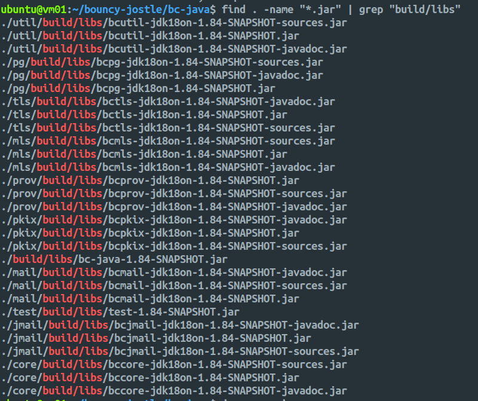

# Bouncy Castle (Java)

**Author:** [Shubham Kumar](https://www.linkedin.com/in/chmodshubham/)

**Published:** January 25, 2026

This document provides a formal, technical procedure for deploying and building the [Bouncy Castle](https://github.com/bcgit/bc-java) Crypto APIs on Ubuntu 22.04 using OpenJDK 25.

> **Note:** This documentation is a replica of the README available at the [github/ngkore/bouncy-castle-java](https://github.com/ngkore/bouncy-castle-java). Please refer to the original repository for the most up-to-date information.

## 1. Environment Setup

### 1.1. Install OpenJDK 25

The build process requires a modern Java Development Kit. Follow these steps to manually install OpenJDK 25 and configure the system path.

```bash
# Download the OpenJDK Java 25 binary
wget https://download.java.net/java/GA/jdk25.0.1/2fbf10d8c78e40bd87641c434705079d/8/GPL/openjdk-25.0.1_linux-x64_bin.tar.gz

# Create installation directory and extract
sudo mkdir -p /opt/java
sudo tar -xzf openjdk-25.0.1_linux-x64_bin.tar.gz -C /opt/java
sudo mv /opt/java/jdk-25.0.1 /opt/java/jdk-25
```

### 1.2. Configure Environment Variables

To ensure the system recognizes the new Java version, update your shell profile (e.g., `~/.bashrc`).

```bash
export JAVA_HOME=/opt/java/jdk-25
export PATH=$PATH:$JAVA_HOME/bin

# (Optional) Multi-JDK Testing: Define paths for older JVMs to test compatibility
# export BC_JDK8=/path/to/java8
# export BC_JDK11=/path/to/java11
# export BC_JDK17=/path/to/java17
# export BC_JDK25=/path/to/java25
```

Apply changes: `source ~/.bashrc`

## 2. Repository Acquisition

Bouncy Castle relies on a separate repository for regression test data. Both must be cloned into the same parent directory.

```bash
mkdir bc-workspace && cd bc-workspace
git clone https://github.com/bcgit/bc-java.git
git clone https://github.com/bcgit/bc-test-data.git
```

## 3. Build Process

Navigate to the project root and use the Gradle wrapper. The build supports skipping tests for rapid deployment.

```bash
cd bc-java
chmod +x gradlew
./gradlew clean build

# to skip tests
./gradlew clean build -x test
```

## 4. Artifact Management

### 4.1. Locate Generated Files

Upon a successful build, each module generates artifacts in its respective `build/libs` directory. Use the following command to list all binaries:

```bash
find . -name "*.jar" | grep "build/libs"
```



### 4.2. Understanding Artifact Types

Each module produces three distinct JAR types:

- `*.jar`: The primary compiled binary required for production use.
- `*-sources.jar`: Contains the source code for IDE debugging and reference.
- `*-javadoc.jar`: Contains the API documentation.

### 4.3. Module Reference Table

| Module       | Purpose                            | Artifact Path      | Output JAR (v1.84)                 |
| ------------ | ---------------------------------- | ------------------ | ---------------------------------- |
| **Provider** | Main JCE/JCA crypto provider       | `prov/build/libs/` | `bcprov-jdk18on-1.84-SNAPSHOT.jar` |
| **Core**     | Lightweight low-level crypto API   | `core/build/libs/` | `bccore-jdk18on-1.84-SNAPSHOT.jar` |
| **PKIX**     | Certificates (X.509), CMS, PKCS#12 | `pkix/build/libs/` | `bcpkix-jdk18on-1.84-SNAPSHOT.jar` |
| **TLS**      | TLS/SSL & JSSE provider            | `tls/build/libs/`  | `bctls-jdk18on-1.84-SNAPSHOT.jar`  |
| **Util**     | ASN.1 and PKIX utility classes     | `util/build/libs/` | `bcutil-jdk18on-1.84-SNAPSHOT.jar` |
| **PG**       | OpenPGP implementation             | `pg/build/libs/`   | `bcpg-jdk18on-1.84-SNAPSHOT.jar`   |

## 5. Verification

### 5.1. Artifact Integrity (Optional)

If utilizing pre-compiled artifacts from [Maven Central](https://www.bouncycastle.org/download/bouncy-castle-java/#latest), verify them against the Bouncy Castle public key using GnuPG.

```bash
# Dearmor the public key
gpg -o bc_maven_public_key.gpg --dearmor bc_maven_public_key.asc

# Verify the JAR signature
gpg --no-default-keyring --keyring ./bc_maven_public_key.gpg --verify <file_name>.jar.asc <file_name>.jar
```

### 5.2. Functional Deployment Test

To verify the installation on OpenJDK 25, compile and run the following Java snippet.

Save this code as `VerifyDeployment.java`:

```java
import java.security.Security;
import org.bouncycastle.jce.provider.BouncyCastleProvider;

public class VerifyDeployment {
    public static void main(String[] args) {
        BouncyCastleProvider bc = new BouncyCastleProvider();
        Security.addProvider(bc);
        System.out.println("Bouncy Castle Provider Version: " + bc.getVersionStr());
        System.out.println("Registration Status: " + (Security.getProvider("BC") != null ? "Success" : "Failed"));
    }
}
```

Execute the following commands to link the provider JAR and verify the build:

```bash
export BC_JAR="./prov/build/libs/bcprov-jdk18on-1.84-SNAPSHOT.jar"
javac -cp "$BC_JAR" VerifyDeployment.java
java -cp "$BC_JAR:." VerifyDeployment
```
