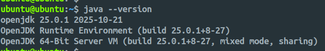
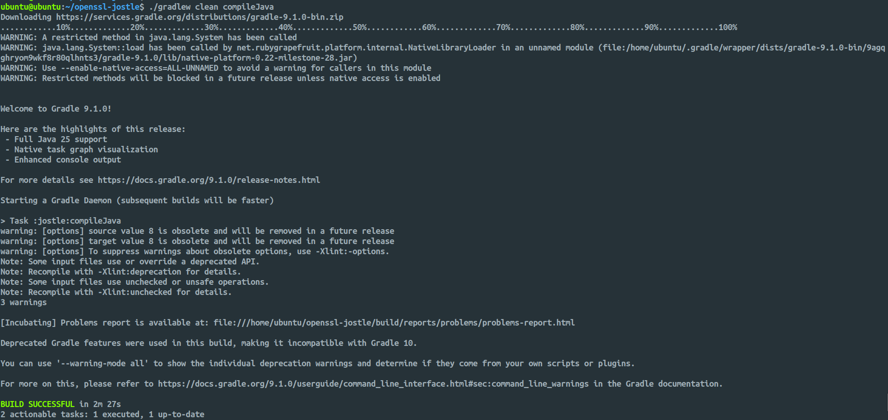
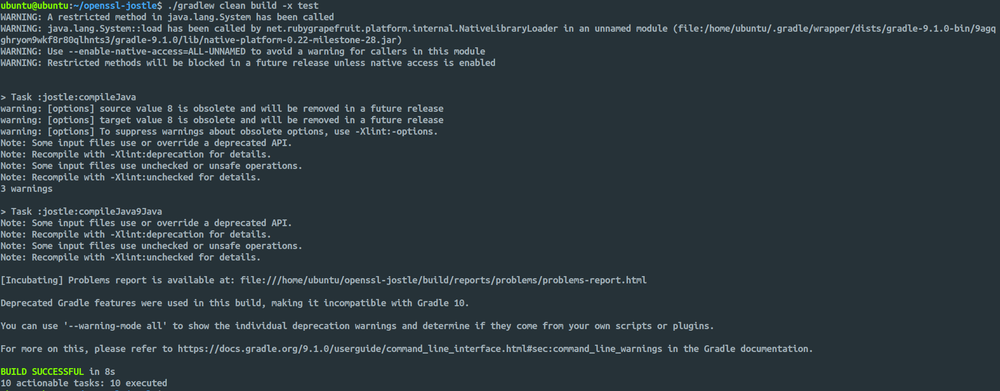
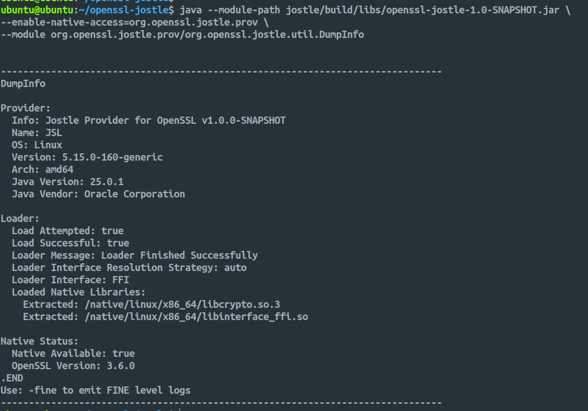

# OpenSSL Jostle

**Author:** [Shubham Kumar](https://www.linkedin.com/in/chmodshubham/)

**Published:** November 08, 2025

[OpenSSL Jostle](https://github.com/openssl-projects/openssl-jostle) is a Java provider that wraps OpenSSL native library features into a standard Java JCA/JCE Provider. This guide covers the deployment process on a Linux system.

> **Note:** This documentation is a replica of the README available at the [github/ngkore/jostle](https://github.com/ngkore/jostle). Please refer to the original repository for the most up-to-date information.

## Prerequisites

The deployment requires Java 25 to build, though the final jar supports Java 1.8 to Java 25. You will also need CMake version 3.31 or higher.

## Deployment Steps

### 1. System Preparation

Update system packages and install build dependencies:

```bash
sudo apt update && sudo apt upgrade
sudo apt install -y build-essential checkinstall zlib1g-dev libssl-dev
sudo apt install -y perl-modules perl-doc
```

### 2. Build OpenSSL Library 3.5+

OpenSSL Library 3.5+ source bundle can be downloaded from [OpenSSL Downloads](https://openssl-library.org/source/).

```bash
wget https://github.com/openssl/openssl/releases/download/openssl-3.6.0/openssl-3.6.0.tar.gz
tar -xzf openssl-3.6.0.tar.gz
cd openssl-3.6.0/
```

Configure and build OpenSSL with a local prefix:

```bash
## installing it to a local directory, openssl_3_6 instead of system-wide installation
./Configure --prefix=`pwd`/../openssl_3_6
make clean
make -j$(nproc)
make install_sw
```

Set the OPENSSL_PREFIX environment variable:

```bash
cd ../openssl_3_6/
export OPENSSL_PREFIX=`pwd`
echo "${OPENSSL_PREFIX}"
cd ..
```

### 3. Install OpenJDK Java 25

Download the OpenJDK Java 25 [download page](https://jdk.java.net/25/).

```bash
wget https://download.java.net/java/GA/jdk25.0.1/2fbf10d8c78e40bd87641c434705079d/8/GPL/openjdk-25.0.1_linux-x64_bin.tar.gz

# Create directory for Java installation
sudo mkdir -p /opt/java

# Extract the tar.gz file to /opt/java
sudo tar -xzf openjdk-25.0.1_linux-x64_bin.tar.gz -C /opt/java

# Rename for easier access (optional)
sudo mv /opt/java/jdk-25.0.1 /opt/java/jdk-25
```

**Set Environment Variables**

Configure `JAVA_HOME` and `PATH` variables for your system:

```bash
# Edit your bash profile
vim ~/.bashrc

# Add these lines at the end of the file:
export JAVA_HOME=/opt/java/jdk-25
export PATH=$PATH:$JAVA_HOME/bin

# Apply the changes
source ~/.bashrc
```

Check that Java 25 is installed correctly:

```bash
java --version
javac --version
echo $JAVA_HOME
```



For system-wide installation (all users), edit `/etc/environment`:

```bash
sudo vim /etc/environment

# Add this line:
JAVA_HOME="/opt/java/jdk-25"
PATH="/usr/local/sbin:/usr/local/bin:/usr/sbin:/usr/bin:/sbin:/bin:/opt/java/jdk-25/bin"
```

### 4. Install CMake

Download and install CMake 4.1.2 (or any version >= 3.31 will work), see https://github.com/Kitware/CMake/releases/:

```bash
wget https://github.com/Kitware/CMake/releases/download/v4.1.2/cmake-4.1.2-linux-x86_64.tar.gz
tar -xzf cmake-4.1.2-linux-x86_64.tar.gz
sudo cp -r cmake-4.1.2-linux-x86_64 /opt/cmake
sudo ln -s /opt/cmake/bin/cmake /usr/local/bin/cmake
cmake --version
```


### 5. Build OpenSSL JOSTLE

Clone the repository:

```bash
git clone https://github.com/openssl-projects/openssl-jostle.git
cd openssl-jostle/
```

Generate Java headers:

```bash
./gradlew clean compileJava
```



Enable operations testing support (optional):

```bash
export JOSTLE_OPS_TEST=true

# To unset
unset JOSTLE_OPS_TEST
```

Build the interface libraries:

```bash
./interface/build.sh
```

The command will compile the C/C++ interface layer that bridges Java and OpenSSL. This script uses `CMAKE` and the previously set `OPENSSL_PREFIX` to find OpenSSL libraries. It generates both JNI (Java Native Interface) and FFI (Foreign Function Interface) bindings. The compiled libraries are automatically copied to `jostle/src/main/resources/native/`.

Build the final jar:

```bash
./gradlew clean build

## To skip tests during build
./gradlew clean build -x test
```



Complete build output (without skipping tests) can be found in [gradle-build.log](https://github.com/ngkore/jostle/blob/main/gradlew-build.log).

### 6. Verify Installation

Run the DumpInfo utility to verify successful deployment:

```bash
java --module-path jostle/build/libs/openssl-jostle-1.0-SNAPSHOT.jar \
--enable-native-access=org.openssl.jostle.prov \
--module org.openssl.jostle.prov/org.openssl.jostle.util.DumpInfo
```



## Build Output

The compiled jar file will be located at:

```
openssl-jostle/jostle/build/libs/openssl-jostle-1.0-SNAPSHOT.jar

```

## Interface Selection

JOSTLE defaults to FFI interface when available. To force JNI interface:

```bash
java -Dorg.openssl.jostle.loader.interface=JNI \
--module-path jostle/build/libs/openssl-jostle-1.0-SNAPSHOT.jar \
--enable-native-access=org.openssl.jostle.prov \
--module org.openssl.jostle.prov/org.openssl.jostle.util.DumpInfo
```

Interface Options:

| Option | Description                                                    |
| :----- | :------------------------------------------------------------- |
| `auto` | Automatically detect and use FFI if available, otherwise JNI   |
| `ffi`  | Force FFI interface only                                       |
| `jni`  | Force JNI interface only                                       |
| `none` | Do not extract interface libraries (for custom configurations) |

## Tutorial Video

[The OpenSSL Jostle Project Deployment Guide](https://youtu.be/VjXnHwPAvic?si=CDVw6I6v6pZvQ0eN)
